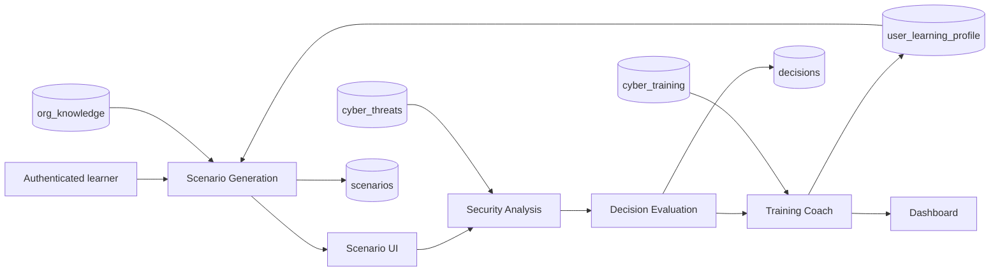

# CyberGuard AI — Final Assignment Report

**Module:** IT 3041 — Information Retrieval and Web Analytics  
**Project:** Adaptive Multi-Agent Cybersecurity Awareness and Decision Training System  
**Build evaluated:** 16 September 2026

## Abstract

CyberGuard AI is a university prototype that replaces static cybersecurity quizzes with personalized, reasoning-aware training. An authenticated learner receives a role-specific scenario grounded in organization policy, selects an action, explains the decision, receives an explainable evaluation grounded in threat knowledge, and then receives adaptive coaching. The next challenge changes according to the stored result.

The system uses **three member-owned pipelines containing four specialized components**: Scenario Generation, Security Analysis, Decision Evaluation, and Training Coach. FastAPI exposes authenticated REST contracts, Next.js provides the learner interface, Supabase PostgreSQL stores durable state, and pgvector supports three retrieval collections. OpenAI is used for structured generation and embeddings, with deterministic fallbacks for classroom continuity.

## Problem and assignment scope

Most awareness training is generic, periodic, and unable to explain why a learner made an unsafe decision. This project addresses that gap through:

- organization- and role-aware simulated threats;
- action plus free-text reasoning evaluation;
- three RAG contexts: organization policy, threat intelligence, and training guidance;
- adaptive next topic, channel, and difficulty;
- authenticated learner history and explainable scoring;
- measurable NLP, retrieval, security, and Responsible AI evidence.

The prototype does not send real phishing messages, execute malware, perform penetration testing, make employment decisions, or provide production SOC/SIEM functionality.

## Architecture

The four components are grouped into the three contribution pipelines:

| Pipeline owner | Main component | End-to-end responsibility |
|---|---|---|
| Member 1 | Scenario Generation | Organization ingestion, sanitization, organization RAG, personalized scenarios, scenario UI and persistence |
| Member 2 | Security Analysis + Decision Evaluation | Threat extraction, threat RAG, reasoning classification, scoring, decision storage, debrief UI |
| Member 3 | Training Coach | Authentication/RBAC, training RAG, adaptive profile, readiness, training map and dashboard |

## Technology

| Layer | Implemented technology |
|---|---|
| Frontend | Next.js 14, React, TypeScript, Tailwind CSS, Framer Motion |
| Backend | Python, FastAPI, Pydantic |
| Database | Supabase PostgreSQL |
| Vector retrieval | pgvector RPCs with 1536-dimensional vectors |
| Generation and evaluation narrative | OpenAI `gpt-4o-mini` |
| Embeddings in evaluated live corpus | OpenAI `text-embedding-3-small` |
| Optional local embedding | `all-MiniLM-L6-v2`, padded from 384 to 1536 dimensions |
| NLP | spaCy-compatible pipelines plus transparent rule-based extraction/classification |
| Authentication | Supabase Auth plus application HS256 JWT and backend RBAC |
| Tests | Pytest and Node’s test runner; browser-level live walkthrough |

## Data and information retrieval

The checked-in corpus contains original paraphrases with direct source URLs and explicit provenance metadata.

| Collection | Live rows | Purpose | Main sources |
|---|---:|---|---|
| `org_knowledge` | Tenant-specific | Ground scenarios in uploaded organization rules | User policy text; fictional NovaTech demo policies are labeled fictional |
| `cyber_threats` | 32 | Ground threat interpretation | FBI IC3, CISA, NIST, MITRE ATT&CK, FTC |
| `cyber_training` | 32 | Ground remediation and coaching | NIST, CISA, MITRE, FTC and related primary guidance |

Every external corpus record includes a record ID, source URL, source type, paraphrase disclosure, and verification date. The live seed records include `embedding_model: text-embedding-3-small`, and runtime queries use the same model. Exact-content checks make seeding repeatable, while `--refresh` re-embeds existing canonical records.

The database provides three matching functions:

- `match_org_knowledge(query_embedding, match_threshold, match_count)`
- `match_threats(query_embedding, match_threshold, match_count)`
- `match_training(query_embedding, match_threshold, match_count)`

## Core workflow

1. Email signup or verified Google OAuth creates a learner profile and application JWT.
2. Onboarding stores the selected role, organization, department, responsibilities, and sanitized policy chunks.
3. The Coach creates a baseline attack surface and seven-channel training map.
4. Scenario Generation reloads the current database role/company, retrieves tenant-correct organization context, masks sensitive content, generates exactly four actions, and stores the scenario with learner ownership.
5. The learner selects one generated action and explains the reasoning.
6. Evaluation reloads that exact learner-owned scenario, validates the selected action, extracts threat signals, retrieves threat context, classifies reasoning, calculates deterministic scores, stores the decision, and adds an LLM explanation.
7. The Coach reloads the stored evaluation, retrieves appropriate training material, calculates readiness and next difficulty, and updates `user_learning_profile`.
8. The dashboard displays durable progress and launches the next recommended topic/channel.

## Actual API contract

All learner-specific routes require `Authorization: Bearer <application JWT>` unless stated otherwise.

| Method | Route | Purpose |
|---|---|---|
| POST | `/api/auth/signup` | Create an email learner account |
| POST | `/api/auth/login` | Authenticate an email learner |
| POST | `/api/auth/google` | Exchange a verified Supabase OAuth session for an application JWT |
| POST | `/api/auth/logout` | Record logout |
| GET | `/api/auth/me` | Read token-backed identity |
| POST | `/api/auth/sync-user` | Synchronize a verified auth user into `public.users` |
| GET | `/api/auth/admin/users` | Admin-only access-control demonstration |
| POST | `/api/org/onboard-policy` | Sanitize, extract, embed, and store organization policy |
| GET | `/api/org/policies/{company_or_user_id}` | Read tenant-authorized policy metadata |
| POST | `/api/coach/onboard-user` | Create baseline learning profile and training map |
| POST | `/api/generate-scenario` | Generate and persist a personalized scenario |
| GET | `/api/scenarios/{scenario_id}` | Load an owned scenario |
| POST | `/api/agents/evaluate` | Evaluate an owned scenario decision |
| POST | `/api/coach/process-decision` | Update coaching from the stored authoritative decision |
| GET | `/api/coach/dashboard-summary` | Return readiness, journey, training map, and next challenge |

## Database model

The core durable tables are:

- `users`: identity, business role, organization, access role, activation and readiness;
- `scenarios`: learner ownership, target role, difficulty, threat type and structured content;
- `decisions`: action, reasoning, scores, verdict and review flag;
- `user_learning_profile`: next focus, tactic, channel, difficulty and training map;
- `org_knowledge`, `cyber_threats`, `cyber_training`: vector knowledge collections;
- `agent_audit_logs`: selected authentication and Coach events with structured details.

RLS policies protect user-owned rows. Backend service-role access performs trusted server operations. Scenario/evaluation endpoints also enforce ownership in application logic.

## Security controls

- Signed HS256 application JWT with minimum 32-character secret.
- Public signup fixed to `learner`; access-role elevation is not accepted from the browser.
- Supabase password storage and Google provider authentication.
- JWT-derived identity overrides browser-supplied user IDs.
- Scenario ownership and cross-user lookup rejection.
- Generated-choice validation and request length limits.
- Per-user in-process evaluation rate limit.
- Policy file type and 100,000-character size limits.
- PII masking for email, telephone and financial patterns before storage/prompting; optional person NER when the spaCy model is installed.
- Benign scenario prompt restrictions; no SMTP, executable payload or attack delivery integration.
- Coach uses the stored evaluation rather than a browser-provided score.
- React Strict Mode evaluation replay guard prevents duplicate state-changing calls in development.

## Responsible AI

**Fairness.** Authoritative scoring receives behavior and reasoning classification, not role or personal attributes. Four role labels produced the same 91.8 score, with a maximum difference of 0.

**Transparency.** The learner sees the selected action, expected defense, action score, reasoning score, final score, detected indicators, reasoning review and Coach takeaway.

**Privacy.** The platform masks common sensitive patterns, minimizes stored profile data, scopes organization retrieval by authenticated user/company, and does not use real malware or active attack links.

**Robustness.** A prompt-injection answer requesting 100 points while authorizing an unsafe app scored 16/100. Deterministic scores remain authoritative, and LLM prose cannot replace them.

**Human oversight.** Ambiguous results can be flagged with `human_review_required`. The current admin review page is a demonstration surface and is not yet a complete server-backed workflow.

## Evaluation results

| Evidence | Result |
|---|---:|
| Backend automated tests | **48 passed** |
| Frontend automated tests | **24 passed** |
| TypeScript and production build | **Passed** |
| Threat extraction F1 | **0.849** |
| Reasoning classification accuracy, 12-case set | **1.000** |
| PII pattern sanitization F1, 6-case set | **1.000** |
| Threat retrieval P@3 / R@3 / Hit@3 | **0.567 / 0.733 / 1.000** |
| Training retrieval P@3 / R@3 / Hit@3 | **0.542 / 0.750 / 1.000** |
| Score consistency, 20 repeats | **0.000 standard deviation** |
| Role fairness difference | **0.000 points** |
| Live Scenario Agent validity | **3/3** |
| Live Scenario Agent mean latency | **4.20 seconds** |
| Forced provider failure fallback | **Valid** |

The full methodology and limits appear in `docs/EVALUATION_REPORT_2026-09-16.md`; raw values are in `docs/evidence/evaluation_results.json`.

## Live browser evidence

The tested flow was:

`signup → profile → policy ingestion → AI onboarding → scenario → decision → evaluation → Coach → dashboard`

For the test learner, Supabase contained exactly two scenarios, two safe decisions, one learning profile, and four tenant-scoped policy chunks. The dashboard displayed the onboarded role/company, decision journey, policy count and 90/100 readiness. A second evaluation after the Strict Mode fix generated exactly one decision and one Coach update.

The Google provider endpoint redirects successfully to Google Accounts with the configured Supabase callback and OAuth client, proving that the provider is enabled. A complete personal Google login requires the account owner to enter credentials and approve the ordinary Google consent flow.

## Contribution evidence

Member 1 implemented and documented scenario generation/personalization, organization policy ingestion and retrieval, sanitization, scenario ownership and persistence, scenario UI integration, secure cross-agent contracts, live corpus preparation/seeding support, the reproducible evaluation script, E2E verification, and final assignment documentation. Member-specific implementation history is recorded in `docs/member_1/2026-09-16.md`.

The repository also records Member 2 and Member 3 design/implementation plans. Final submission should attach each member’s Git commits or pull requests as independent contribution evidence.

## Limitations and future work

- The evaluation sets are small and internally labeled; independent assessment and more participants are required.
- Person-name NER requires the optional `en_core_web_sm` model, which was absent in the measured environment.
- Rate limiting is process-local and should move to a shared production store.
- Local development CORS is permissive and must be restricted for deployment.
- TLS, monitoring, backups, secret rotation and contractual zero-retention controls are deployment responsibilities.
- The admin review UI uses demonstration cases and should be connected to flagged database decisions.
- Google OAuth needs a final account-owner sign-in test on the intended deployed redirect domain.
- The process-local fallback resets when the backend restarts and is only for classroom resilience.
- A controlled multi-participant usability study remains necessary before making usability claims.

## Conclusion

The assignment’s core learner loop is implemented, live, measurable and documented. The system demonstrates NLP, three uses of information retrieval, secure stateful agent coordination, explainable adaptive feedback, and basic Responsible AI controls. The remaining items are deployment hardening and broader independent evaluation rather than missing core assignment functionality.
