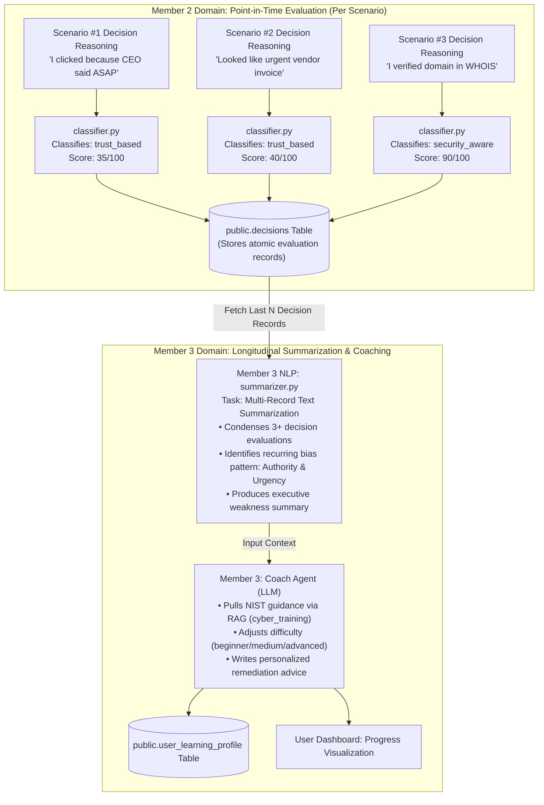

# 🧠 NLP Responsibility & Differentiation Analysis: Member 2 vs. Member 3

> **CyberGuard AI — Architecture & Viva Defense Documentation**  
> **Topic:** Clarification of Natural Language Processing (NLP) Boundaries  
> **Document Purpose:** Proves non-overlapping, complementary contribution between Member 2 (Decision Classification) and Member 3 (Longitudinal Weakness Summarization) under the [3-Member Balanced Contribution Model](../../docs/3-Member%20Balanced%20Contribution%20Model.pdf).

---

## 1. Executive Summary: Why There Is Zero Overlap

In accordance with the project specification ([3-Member Balanced Contribution Model](../../docs/3-Member%20Balanced%20Contribution%20Model.pdf), Page 8 & Page 11), the NLP domain is explicitly divided into three non-overlapping tasks:
* **Member 1 (Entity Extraction / Masking):** Uses `spaCy` NER in [`backend/nlp/ner.py`](file:///c:/Users/user/Desktop/PROJECT/CyberGuard_AI/backend/nlp/ner.py) to sanitize incoming company data and mask PII before LLM prompting.
* **Member 2 (Single-Instance Text Classification):** Uses `spaCy` token matching and rule scoring in [`backend/nlp/classifier.py`](file:///c:/Users/user/Desktop/PROJECT/CyberGuard_AI/backend/nlp/classifier.py) to classify a user's single written explanation into discrete categories (`security-aware`, `trust-based`, `naive`).
* **Member 3 (Longitudinal Text Summarization):** Uses text summarization algorithms in [`backend/nlp/summarizer.py`](file:///c:/Users/user/Desktop/PROJECT/CyberGuard_AI/backend/nlp/) to condense multiple past decision logs into an executive weakness summary that drives the Coach Agent.

---

## 2. Technical Comparison Matrix

| Architectural Dimension | Member 2: Decision Classification ([classifier.py](file:///c:/Users/user/Desktop/PROJECT/CyberGuard_AI/backend/nlp/classifier.py)) | Member 3: Weakness Summarization ([summarizer.py](file:///c:/Users/user/Desktop/PROJECT/CyberGuard_AI/backend/nlp/)) |
| :--- | :--- | :--- |
| **Formal NLP Task** | **Text Classification** (Multi-class / Rule-based) | **Multi-Document Text Summarization** (Extractive / Abstractive) |
| **Data Input** | A **single string** written by the user for **one** scenario:<br>*"I sent the invoice because the CEO marked it urgent."* | A **collection of past records** across 5–10 previous scenarios from `public.decisions`. |
| **Temporal Scope** | **Point-in-Time (Instantaneous)**:<br>Evaluates what the user is thinking *right now* in this single moment. | **Longitudinal (Across Time)**:<br>Analyzes cumulative training history over days or weeks. |
| **Target Document** | User's immediate reasoning input for the active scenario. | Historical database records, threat tags, and past evaluation feedback paragraphs. |
| **Core Algorithm** | Token matching, POS tagging, and category scoring (`spaCy`) against fixed keyword sets (`security_aware`, `trust_based`, `naive`). | TextRank / Sentence graph centrality / Frequency-based synthesis to compress multi-paragraph histories into key vulnerability insights. |
| **Output Format** | Discrete category label + confidence float:<br>`{"category": "trust_based", "confidence": 0.85}` | Cohesive natural language synthesis paragraph:<br>*"Learner has mastered domain verification across 6 attempts, but repeatedly concedes to executive urgency in wire transfer workflows."* |
| **Downstream Consumer** | Member 2's **Evaluation Agent** (used to calculate the user's score for this scenario). | Member 3's **Coach Agent** (used as contextual background for adaptive next-step recommendations). |
| **Database Interaction** | Read-only input from HTTP request body; saved to `public.decisions.evaluation`. | Reads array of past evaluations from `public.decisions`; writes longitudinal summary to `public.user_learning_profile`. |

---

## 3. End-to-End Pipeline & Data Flow

Member 3 does **not** re-classify user sentences. Member 3 **consumes Member 2's classified outputs over time** as training data:



---

## 4. Code Architecture Comparison

### Member 2's Implementation (`backend/nlp/classifier.py`):
```python
# Member 2 classifies ONE immediate sentence from the user
class ReasoningClassifier:
    def classify(self, user_reasoning: str) -> Dict[str, Any]:
        doc = self.nlp(user_reasoning.lower())
        # Computes category score for the single sentence:
        # returns: {"category": "trust_based", "confidence": 0.85}
```

### Member 3's Implementation (`backend/nlp/summarizer.py`):
```python
# Member 3 summarizes MULTIPLE historical evaluations across time
from typing import List, Dict, Any

class WeaknessSummarizer:
    def __init__(self):
        # Uses sentence graph weighting / TextRank / semantic compression
        pass

    def summarize_decision_history(self, decisions: List[Dict[str, Any]]) -> str:
        """
        Input: 5-10 historical records from public.decisions containing:
               - chosen_action
               - reasoning
               - evaluation (from Member 2)
               - threat_indicators
               
        Output: A concise, synthesized summary paragraph of recurring cognitive patterns:
        "User consistently identifies spoofed domain names but exhibits vulnerability 
         to urgent transfer requests from simulated executive authority figures."
        """
        if not decisions:
            return "No prior decision history available. Commencing baseline evaluation."
        
        # 1. Aggregate threat indicators and error types across attempts
        # 2. Score sentence importance based on repeated failure modes
        # 3. Synthesize and compress into executive guidance
        summary = self._extract_key_vulnerabilities(decisions)
        return summary
```

---

## 5. Viva Defense Script for Member 3

When the viva examination panel evaluates individual contribution, use this script to defend your NLP boundary:

### Question from Examiner:
> *"Member 2 already extracts urgency and classifies reasoning as 'trust-based'. Why does Member 3 also have an NLP module that talks about urgency and authority bias? Isn't this duplicate work?"*

### Model Answer for Member 3:
> *"No, Professor, they are completely different NLP tasks operating at different temporal scopes in the architecture:*
>
> 1. ***Task Type Difference:***  
>    * *Member 2 performs **Single-Sentence Text Classification** on the user's immediate input during an active scenario to assign a grade for that single decision.*  
>    * *My module in [`summarizer.py`](file:///c:/Users/user/Desktop/PROJECT/CyberGuard_AI/backend/nlp/) performs **Multi-Record Text Summarization**. It does not classify sentences; it reads multiple historical evaluation texts from PostgreSQL and condenses them into an executive cognitive profile.*
>
> 2. ***Temporal Scope Difference:***  
>    * *Member 2's classifier evaluates what the user is doing **at this second**.*  
>    * *My summarizer analyzes how the user has behaved **over their last 10 scenarios** to uncover longitudinal bias trends.*
>
> 3. ***System Pipeline Integration:***  
>    * *Member 2's output is an atomic label stored in `public.decisions`. My summarizer consumes those past records as an input corpus to produce natural-language context for my **Training Coach Agent**, which uses it to adapt the user's next learning milestone.*
>
> *This follows the exact division specified on Page 8 of our project's 3-Member Balanced Contribution Model: Member 1 did Entity Extraction, Member 2 did Text Classification, and Member 3 did Summarization."*
