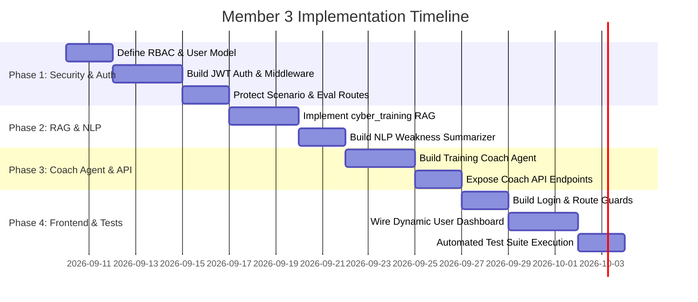

# 👤 Member 3 Implementation Plan — Adaptive Training & User Security

> **Official Project Implementation Plan — CyberGuard AI**  
> **Author:** Member 3  
> **Specification Standard:** 100% Compliant with [3-Member Balanced Contribution Model](../../docs/3-Member%20Balanced%20Contribution%20Model.pdf)  
> **Core Identity for the Viva:**  
> *"I build the system that converts the user's weaknesses into personalized training and secures the platform end-to-end."*

---

## 🧭 Executive Summary & Balanced Model Alignment

In accordance with the **3-Member Balanced Contribution Model**, every team member builds one complete functional slice of the system from end-to-end:
$$\text{Each Member} = \text{1 Agent} + \text{NLP/IR Work} + \text{API Integration} + \text{Security} + \text{UI} + \text{Testing} + \text{Documentation}$$

This implementation plan establishes Member 3's complete domain: **Adaptive Training & User Security**. It closes the critical multi-agent feedback loop by ingesting evaluation scores from Member 2, retrieving authoritative NIST/SANS remediation guidance, generating personalized coaching insights using a **Training Coach Agent**, updating the learner's longitudinal profile, and securing the entire application with Supabase Auth and Role-Based Access Control (RBAC).

```mermaid
flowchart TD
    subgraph M1 ["Member 1: Scenario Pipeline"]
        SA[Scenario Agent\nGroq / Llama-3] --> |Scenario JSON| SC[Scenario UI]
    end

    subgraph M2 ["Member 2: Evaluation Pipeline"]
        SC --> |Decision + Reasoning| EA[Evaluation Agent\nOpenAI / GPT-4o]
        EA --> |Evaluation JSON\nScore + Weaknesses| CA
    end

    subgraph M3 ["Member 3: Adaptive Training & Security Pipeline"]
        CA[Training Coach Agent\nLLM + Adaptive Logic]
        SUM[NLP Weakness Summarizer\nCognitive Profiling] --> CA
        TR[Training RAG\npgvector / cyber_training] --> CA
        CA --> |Updates Profile| ULP[(user_learning_profile)]
        CA --> |Coaching + Next Path| UD[User Dashboard\nNext Challenge & Visualizer]
        AUTH[Auth & RBAC Middleware\nSupabase JWT] -. Secures .-> M1
        AUTH -. Secures .-> M2
        AUTH -. Secures .-> M3
    end

    UD -. Loops Back .-> SA
```

---

## 📊 Cross-Check Verification Matrix

| Architecture Area | 3-Member Balanced Model Mandate | Member 3 Implementation Deliverables | File / Artifact Reference |
| :--- | :--- | :--- | :--- |
| **1. AI / Agent** | **Training Coach Agent (`CoachAgent`)**<br>• Adaptive recommendation logic<br>• Next-scenario difficulty & topic selection<br>• Structured LLM prompt & response control | • `CoachAgent` class implementing multi-metric adaptive scoring<br>• Dynamic difficulty scaling (Beginner → Intermediate → Advanced)<br>• Structured JSON feedback generation | [backend/agents/coach_agent.py](file:///c:/Users/user/Desktop/PROJECT/CyberGuard_AI/backend/agents/coach_agent.py) |
| **2. NLP Layer** | **NLP Summarization**<br>• Summarize user weaknesses across past decisions<br>• Identify recurring vulnerability patterns<br>• Generate concise cognitive feedback | • Extractive & abstractive weakness summarization<br>• Synthesize decision history to identify bias traps (e.g., *urgency*, *authority bias*) | [backend/nlp/summarizer.py](file:///c:/Users/user/Desktop/PROJECT/CyberGuard_AI/backend/nlp/summarizer.py)<br>*(See [NLP Differentiation Analysis](file:///c:/Users/user/Desktop/PROJECT/CyberGuard_AI/docs/member_3/NLP_DIFFERENTIATION.md))* |
| **3. Information Retrieval (IR / RAG)** | **Training Knowledge RAG**<br>• Retrieve NIST SP 800-50 & SANS training materials<br>• Connect identified weaknesses to educational remediation | • Vector similarity search on `public.cyber_training`<br>• Top-k semantic retrieval using `pgvector` & SentenceTransformers | [backend/rag/training_retrieval.py](file:///c:/Users/user/Desktop/PROJECT/CyberGuard_AI/backend/rag/training_retrieval.py) |
| **4. Security Layer** | **Authentication + RBAC + User Data Protection**<br>• Secure token verification (JWT)<br>• Role separation (Learner / Trainer / Admin)<br>• Row Level Security (RLS) enforcement | • Supabase Auth JWT validation middleware<br>• Strict separation of `users.role` (job) vs `users.access_role` (RBAC)<br>• Route-level authorization guards for FastAPI & Next.js | [backend/api/auth_routes.py](file:///c:/Users/user/Desktop/PROJECT/CyberGuard_AI/backend/api/auth_routes.py)<br>[backend/security/auth_bearer.py](file:///c:/Users/user/Desktop/PROJECT/CyberGuard_AI/backend/security/auth_bearer.py) |
| **5. Agent Communication** | **REST API + JSON Inter-Agent Protocol**<br>• Ingest Member 2 evaluation payload<br>• Output coaching feedback & next scenario params | • `POST /api/coach/process-decision`<br>• Ingests `{scenario_id, score, weaknesses, threat_type}`<br>• Emits `{feedback, recommended_topic, next_difficulty}` | [backend/api/coach_routes.py](file:///c:/Users/user/Desktop/PROJECT/CyberGuard_AI/backend/api/coach_routes.py) |
| **6. Database Ownership** | **User State & Knowledge Tables**<br>• `public.user_learning_profile`<br>• `public.cyber_training`<br>• `public.users` (auth & progress) | • Full CRUD & update pipeline on `user_learning_profile`<br>• Vector embeddings index on `cyber_training`<br>• Auth audit logging in `agent_audit_logs` | [backend/database/schema.sql](file:///c:/Users/user/Desktop/PROJECT/CyberGuard_AI/backend/database/schema.sql) |
| **7. Frontend Application** | **User Dashboard & Auth UI**<br>• Interactive progress & radar visualization<br>• Personalized next challenge launcher<br>• Login & session management UI | • Dynamic Next.js dashboard connecting to Coach API<br>• Weakness breakdown bars (Phishing, BEC, Urgency)<br>• Login/Logout flow with token persistence | [frontend/app/dashboard/page.tsx](file:///c:/Users/user/Desktop/PROJECT/CyberGuard_AI/frontend/app/dashboard/page.tsx)<br>[frontend/app/login/page.tsx](file:///c:/Users/user/Desktop/PROJECT/CyberGuard_AI/frontend/app/login/page.tsx) |
| **8. Testing Suite** | **Testing & Validation**<br>• Auth & RBAC access tests<br>• Coach Agent adaptive logic tests<br>• Vector retrieval tests | • Pytest test suite covering authentication, token tampering, RBAC privilege escalation, adaptive scoring, and RAG retrieval | [backend/tests/test_auth_routes.py](file:///c:/Users/user/Desktop/PROJECT/CyberGuard_AI/backend/tests/test_auth_routes.py)<br>[backend/tests/test_coach_agent.py](file:///c:/Users/user/Desktop/PROJECT/CyberGuard_AI/backend/tests/test_coach_agent.py) |
| **9. Responsible AI** | **Privacy & Transparency**<br>• Explainable training recommendations<br>• Learner performance data isolation | • Transparent algorithmic justification for difficulty adjustments<br>• Supabase RLS policies preventing cross-user data leakage | [docs/RESPONSIBLE_AI_PLAN.md](file:///c:/Users/user/Desktop/PROJECT/CyberGuard_AI/docs/RESPONSIBLE_AI_PLAN.md) |

---

## 🛠️ Member 3 Tech Stack Focus

* **LLM Engine:** OpenAI API (`gpt-4o-mini` / `gpt-4o`) — Structured JSON generation for coaching guidance and pedagogical feedback.
* **NLP Processing:** `spaCy` (`en_core_web_sm`) / Extractive Frequency Synthesizer for weakness summarization across past training attempts.
* **Information Retrieval (RAG):** Supabase `pgvector` with SentenceTransformers (`all-MiniLM-L6-v2` / OpenAI `text-embedding-3-small`) querying `public.cyber_training`.
* **Security & Auth:** Supabase Auth (managed JWT tokens), FastAPI HTTPBearer dependency injection, PBKDF2/Argon2 password safeguards, and PostgreSQL Row-Level Security (RLS).
* **Backend Framework:** FastAPI with Pydantic v2 schemas and asynchronous database interaction via `supabase-py`.
* **Frontend Framework:** Next.js 14 (App Router), TailwindCSS, Framer Motion for dashboard telemetry and journey visualization.

---

## 📋 Comprehensive Step-by-Step Implementation Plan



---

### Phase 1: Authentication, RBAC & Security Infrastructure

#### Step 1.1: Database Schema Hardening for RBAC
To protect the system without breaking Member 1's role-based scenario generator (which relies on `users.role` for job positions like "Finance Manager"), Member 3 separates **Business Role** from **System Access Role**.

* **Target File:** [backend/database/schema.sql](file:///c:/Users/user/Desktop/PROJECT/CyberGuard_AI/backend/database/schema.sql)
* **Action:** Ensure `public.users` includes:
  ```sql
  ALTER TABLE public.users 
  ADD COLUMN IF NOT EXISTS access_role TEXT DEFAULT 'learner' CHECK (access_role IN ('learner', 'trainer', 'admin')),
  ADD COLUMN IF NOT EXISTS is_active BOOLEAN DEFAULT true,
  ADD COLUMN IF NOT EXISTS last_login_at TIMESTAMP WITH TIME ZONE;
  ```
* **Row-Level Security (RLS) Rule:** Enforce that learners can only read their own profile and decisions (`auth.uid() = user_id`), while admins have oversight capabilities.

#### Step 1.2: Implement FastAPI Authentication Middleware & JWT Validator
* **Target File:** `backend/security/auth_bearer.py` [NEW]
* **Logic:**
  1. Inspect `Authorization: Bearer <token>` on all incoming requests.
  2. Verify cryptographic signature and expiration against Supabase Auth public keys / JWT secret.
  3. Extract `sub` (user UUID) and query `public.users` to fetch active status and `access_role`.
  4. Inject `CurrentUser(id, email, access_role, job_role)` into the FastAPI request dependency chain.
  5. Raise HTTP `401 Unauthorized` for expired/tampered tokens, and HTTP `403 Forbidden` if an endpoint's required role is not satisfied.

#### Step 1.3: Build Authentication Endpoints
* **Target File:** `backend/api/auth_routes.py` [NEW]
* **Endpoints:**
  * `POST /api/auth/login`: Accepts credentials, authenticates with Supabase Auth, logs audit event, and returns access/refresh tokens.
  * `POST /api/auth/logout`: Revokes active session.
  * `GET /api/auth/me`: Returns current user identity, system access role, and job profile.
  * `POST /api/auth/refresh`: Issues a refreshed session token.

#### Step 1.4: Protect Member 1 & Member 2 API Endpoints
* **Target Files:** [backend/api/scenario_routes.py](file:///c:/Users/user/Desktop/PROJECT/CyberGuard_AI/backend/api/scenario_routes.py), [backend/api/evaluation_routes.py](file:///c:/Users/user/Desktop/PROJECT/CyberGuard_AI/backend/api/evaluation_routes.py)
* **Integration:**
  * Bind `current_user: CurrentUser = Depends(require_authenticated_user)` to both routes.
  * In `/api/agents/evaluate`, replace untrusted request body `user_id` with `current_user.id` so a learner cannot submit evaluations or tamper with records belonging to other users.

---

### Phase 2: Information Retrieval (RAG) on `cyber_training`

#### Step 2.1: Training Knowledge Base Vector Retrieval
While Member 1 queries company workflows (`org_knowledge`) and Member 2 queries threat patterns (`cyber_threats`), Member 3 owns the **Training Guidance** knowledge base (`cyber_training`).

* **Target File:** `backend/rag/training_retrieval.py` [NEW]
* **Database Target:** `public.cyber_training` (schema defined in [schema.sql](file:///c:/Users/user/Desktop/PROJECT/CyberGuard_AI/backend/database/schema.sql#L73-L83)).
* **Logic:**
  1. Receive identified weakness category (e.g., `urgency_bias`, `sender_spoofing`, `credential_harvesting`).
  2. Compute vector embedding of the query using the shared embedding model (`text-embedding-3-small` or `all-MiniLM-L6-v2`).
  3. Perform cosine similarity search via `pgvector`:
     ```sql
     SELECT content, category, source, metadata, 1 - (embedding <=> query_embedding) AS similarity
     FROM public.cyber_training
     WHERE category = :category OR 1 - (embedding <=> query_embedding) > 0.70
     ORDER BY similarity DESC
     LIMIT 3;
     ```
  4. Return authoritative NIST SP 800-50 and SANS training guidance to ground the Coach Agent's recommendations.

---

### Phase 3: NLP Weakness Summarization Layer

#### Step 3.1: Historical Decision Analysis & Weakness Profiling
Every team member has a dedicated NLP responsibility:
* Member 1: Named Entity Recognition & Input Sanitization ([backend/nlp/ner.py](file:///c:/Users/user/Desktop/PROJECT/CyberGuard_AI/backend/nlp/ner.py))
* Member 2: Text Classification for Reasoning ([backend/nlp/classifier.py](file:///c:/Users/user/Desktop/PROJECT/CyberGuard_AI/backend/nlp/classifier.py))
* **Member 3: Weakness Summarization & Trend Synthesis**

* **Target File:** `backend/nlp/summarizer.py` [NEW] *(Detailed boundary comparison in [NLP Differentiation Analysis](file:///c:/Users/user/Desktop/PROJECT/CyberGuard_AI/docs/member_3/NLP_DIFFERENTIATION.md))*
* **Logic:**
  1. Fetch the user's last 5–10 decision records from `public.decisions`.
  2. Parse the evaluated weaknesses, reasoning classifications, and errors.
  3. Extract recurring linguistic and psychological patterns (e.g., *Authority Obedience*, *False Urgency*, *Omission of Verification*).
  4. Generate a concise, human-readable summary of the learner's behavioral tendency:
     > *"User consistently identifies spoofed domain names but exhibits vulnerability to urgent transfer requests from simulated executive authority figures."*
  5. Pass this summary to the Coach Agent to prevent repetitive training on already mastered concepts.

---

### Phase 4: Training Coach Agent & Adaptive Logic (AI Core)

#### Step 4.1: The Training Coach Agent Implementation
The Coach Agent is the central AI component of Member 3. It answers: *"What should this user learn next, and how do we guide them?"*

* **Target File:** `backend/agents/coach_agent.py` [NEW]
* **Core Class:** `TrainingCoachAgent`
* **Workflow:**
  1. **Ingest Evaluation:** Reads Member 2's evaluation JSON (`score`, `threat_indicators`, `reasoning_category`, `is_safe`).
  2. **Fetch History & Context:** Pulls NLP weakness summary and relevant NIST remediation guidance from `training_retrieval.py`.
  3. **Adaptive Difficulty Scaling Engine:**
     $$\text{Next Difficulty} = f(\text{Historical Average}, \text{Latest Score}, \text{Consecutive Safe Decisions})$$
     * Score $< 50$: Lower difficulty or repeat current level with targeted foundational guidance.
     * $50 \le \text{Score} < 80$: Maintain difficulty level; focus on specific vulnerability nuance.
     * Score $\ge 80$: Escalate difficulty (e.g., `beginner` $\to$ `medium`, `medium` $\to$ `advanced-multi-stage`).
  4. **LLM Coaching Generation:** Calls OpenAI with a prompt structured for constructive pedagogical feedback.

```python
# backend/agents/coach_agent.py (Core Architecture)

import json
from typing import Dict, Any, List
from openai import AsyncOpenAI
from rag.training_retrieval import TrainingRetriever
from nlp.summarizer import WeaknessSummarizer

class TrainingCoachAgent:
    def __init__(self, openai_client: AsyncOpenAI):
        self.client = openai_client
        self.retriever = TrainingRetriever()
        self.summarizer = WeaknessSummarizer()

    def calculate_next_difficulty(self, recent_scores: List[int], current_diff: str) -> str:
        avg_score = sum(recent_scores) / max(len(recent_scores), 1)
        levels = ["beginner", "medium", "advanced"]
        curr_idx = levels.index(current_diff.lower()) if current_diff.lower() in levels else 0
        
        if avg_score >= 80 and curr_idx < len(levels) - 1:
            return levels[curr_idx + 1]
        elif avg_score < 45 and curr_idx > 0:
            return levels[curr_idx - 1]
        return levels[curr_idx]

    async def generate_coaching(
        self, 
        user_id: str, 
        evaluation_result: Dict[str, Any],
        current_difficulty: str
    ) -> Dict[str, Any]:
        weaknesses = evaluation_result.get("weaknesses", [])
        
        # 1. RAG Retrieval from cyber_training
        remediation_docs = await self.retriever.retrieve_guidance(weaknesses)
        
        # 2. NLP Weakness Summary
        history_summary = await self.summarizer.summarize_user_tendencies(user_id)
        
        # 3. Adaptive Difficulty Calculation
        next_difficulty = self.calculate_next_difficulty(
            recent_scores=[evaluation_result.get("final_score", 50)],
            current_diff=current_difficulty
        )

        # 4. LLM Generation
        system_prompt = (
            "You are the CyberGuard Training Coach Agent. Your mission is to provide constructive, "
            "empowering, and actionable feedback based on cybersecurity standards (NIST SP 800-50). "
            "Never mock the user. Explain the exact psychological trigger they missed and provide a 1-step rule."
        )
        
        user_prompt = f"""
        Evaluation Data: {json.dumps(evaluation_result)}
        Historical Tendencies: {history_summary}
        NIST Remediation Context: {remediation_docs}
        
        Output ONLY a JSON object with:
        - "feedback": Concise 2-sentence coaching feedback
        - "remediation_tip": A concrete actionable defense rule
        - "recommended_topic": Next cybersecurity threat topic to address
        - "next_difficulty": "{next_difficulty}"
        - "reason_for_path": Why this training was selected
        """

        response = await self.client.chat.completions.create(
            model="gpt-4o-mini",
            messages=[
                {"role": "system", "content": system_prompt},
                {"role": "user", "content": user_prompt}
            ],
            response_format={"type": "json_object"},
            temperature=0.3
        )

        coaching_plan = json.loads(response.choices[0].message.content)
        return coaching_plan
```

---

### Phase 5: Inter-Agent Communication & API Pipeline

#### Step 5.1: Coach Routes & Learning Profile Synchronization
Connects Member 2's evaluation to Member 3's Coach Agent, and updates `public.user_learning_profile` for Member 1 to read.

* **Target File:** `backend/api/coach_routes.py` [NEW]
* **Endpoint:** `POST /api/coach/process-decision`
  * **Input:**
    ```json
    {
      "scenario_id": "SC-102",
      "score": 45,
      "threat_type": "phishing",
      "weaknesses": ["urgency_bias", "unverified_domain"]
    }
    ```
  * **Processing:**
    1. Authenticate user from JWT token (`auth.uid()`).
    2. Invoke `TrainingCoachAgent.generate_coaching(...)`.
    3. Persist coaching update into `public.user_learning_profile`:
       ```sql
       UPDATE public.user_learning_profile
       SET next_difficulty = :next_difficulty,
           next_focus = :recommended_topic,
           tactic_to_target = :weakness,
           updated_at = NOW()
       WHERE user_id = :user_id;
       ```
    4. Record audit trail in `public.agent_audit_logs`.
  * **Output:**
    ```json
    {
      "feedback": "You recognized the strange sender address but acted quickly due to the artificial deadline.",
      "remediation_tip": "When a financial request has an 'URGENT' tag, execute the two-channel verification protocol.",
      "recommended_topic": "Urgency Indicators & BEC",
      "next_difficulty": "medium",
      "reason_for_path": "Focusing on urgency vulnerability identified across 2 consecutive sessions."
    }
    ```

* **Target File:** `backend/api/coach_routes.py`
* **Endpoint:** `GET /api/coach/dashboard-summary`
  * Returns user's readiness score, weakness breakdown radar data (Phishing: 82%, BEC: 45%, Identity Verification: 38%), recent decision journey, and recommended next situation.

---

### Phase 6: Frontend Dashboard & Authentication Integration

#### Step 6.1: Dedicated Login & Session Interface
* **Target File:** `frontend/app/login/page.tsx` [NEW]
* **Features:**
  * Clean cyber-themed login form (Email & Password).
  * Direct integration with Supabase Auth client (`supabase.auth.signInWithPassword`).
  * Seamless token persistence in secure local storage or cookies.
  * Role-based redirection (`learner` $\to$ `/dashboard`, `admin` $\to$ `/admin`).

#### Step 6.2: Dynamic Learner Dashboard with Live Adaptive Feedback
* **Target File:** [frontend/app/dashboard/page.tsx](file:///c:/Users/user/Desktop/PROJECT/CyberGuard_AI/frontend/app/dashboard/page.tsx)
* **Transforming Existing Mock UI into Dynamic Reality:**
  1. Replace static text (*"Good afternoon, Nimal"*, *"You're getting better at noticing when urgency..."*) with live data from `GET /api/coach/dashboard-summary`.
  2. **Next Situation Card:** Displays the exact `recommended_topic` and `next_difficulty` chosen by the Coach Agent. The *"Enter situation"* button links to `/scenario` with preloaded query parameters.
  3. **Decision Journey:** Renders historical decisions stored in `public.decisions` with chronological pulse indicators.
  4. **Weakness Distribution Widget:** Displays user's real-time accuracy across threat vectors (Phishing, Social Engineering, Data Protection, Identity Verification).
  5. **Auth Guards:** Checks session on mount; redirects to `/login` if unauthenticated.

---

### Phase 7: Responsible AI, Privacy & Security Controls

* **Privacy & Isolation:** Enforce Supabase RLS so that no learner can view another learner's learning profile, score history, or coaching recommendations.
* **Explainability (Transparency):** Every coaching recommendation provides the explicit `reason_for_path` so the learner understands why a specific topic or difficulty level was selected.
* **Non-Punitive Coaching:** Prompts strictly forbid shaming language, focusing entirely on constructive skill building.
* **Privilege Escalation Defense:** System access roles (`learner`, `trainer`, `admin`) are validated on the backend via cryptographic JWT claims and database lookup, preventing client-side parameter tampering.

---

### Phase 8: Comprehensive Automated Testing Suite

#### Step 8.1: Auth & RBAC Test Suite
* **Target File:** `backend/tests/test_auth_routes.py` [NEW]
* **Coverage:**
  * Valid login $\to$ 200 OK + JWT bearer token.
  * Invalid password / nonexistent user $\to$ 401 Unauthorized.
  * Tampered / expired JWT $\to$ 401 Unauthorized.
  * Learner attempting to access admin route $\to$ 403 Forbidden.
  * SQL injection and malformed input on login fields.

#### Step 8.2: Coach Agent & Adaptive Logic Test Suite
* **Target File:** `backend/tests/test_coach_agent.py` [NEW]
* **Coverage:**
  * Deterministic difficulty progression (Consecutive high scores $\to$ difficulty escalation; low score $\to$ difficulty decrement).
  * RAG knowledge retrieval correctly fetches relevant NIST entries from `cyber_training`.
  * NLP Weakness Summarizer correctly aggregates common threat types.
  * Inter-agent JSON schema validation matching the contract with Member 2.

---

## 🎯 Contribution Evidence & Git Commit Strategy

To demonstrate individual contribution according to the [3-Member Balanced Contribution Model](../../docs/3-Member%20Balanced%20Contribution%20Model.pdf), Member 3 should commit the following sequence:

```bash
# 1. Security & Authentication Layer
git commit -m "feat(auth): implement Supabase JWT authentication and session handling"
git commit -m "feat(security): add RBAC middleware with distinct business and access roles"
git commit -m "feat(security): enforce route-level authorization guards on scenario and evaluation APIs"

# 2. Knowledge Base & Information Retrieval Layer
git commit -m "feat(rag): implement training_retrieval for cyber_training NIST vector search"

# 3. NLP Summarization Layer
git commit -m "feat(nlp): build cognitive weakness summarizer from user decision history"

# 4. AI Coach Agent Layer
git commit -m "feat(agent): implement Training Coach Agent with adaptive difficulty scaling"
git commit -m "feat(api): create /api/coach routes for inter-agent pipeline and dashboard sync"

# 5. Frontend Dashboard & User Interface
git commit -m "feat(ui): build dedicated login screen with secure session storage"
git commit -m "feat(ui): wire dashboard to live Coach Agent recommendations and decision journey"

# 6. Automated Testing & Verification
git commit -m "test(auth): add automated test suite for authentication and RBAC enforcement"
git commit -m "test(coach): add unit and integration tests for adaptive learning logic"
```

---

## 💡 Inter-Agent Communication Protocol (JSON Schemas)

### Member 2 $\to$ Member 3 Payload
Sent from Member 2's Evaluation Agent to Member 3's Coach Pipeline:
```json
{
  "scenario_id": "9b1deb4d-3b7d-4bad-9bdd-2b0d7b3dcb6d",
  "threat_type": "phishing",
  "chosen_action": "Clicked link to verify account credentials",
  "is_safe": false,
  "action_score": 20,
  "reasoning_score": 40,
  "final_score": 28,
  "threat_indicators": ["urgency", "spoofed_sender", "credential_harvesting"],
  "weaknesses": ["urgency_bias", "sender_verification"],
  "reasoning_category": "naive"
}
```

### Member 3 $\to$ User / Dashboard & Member 1 Payload
Emitted by Member 3's Coach Agent and saved to `public.user_learning_profile`:
```json
{
  "feedback": "You noticed the email seemed odd, but the urgent deadline caused you to bypass domain verification.",
  "remediation_tip": "Always hover over sender addresses. Authentic security teams never demand password verification within 15 minutes.",
  "nist_reference": "NIST SP 800-50 Section 3.2: Recognizing Social Engineering Vectors",
  "recommended_topic": "Identity & Domain Verification",
  "next_difficulty": "beginner",
  "reason_for_path": "Re-establishing fundamental sender verification habits before advancing to multi-stage spear phishing."
}
```

---

## 📝 Comprehensive Viva Preparation Guide for Member 3

When the viva examination occurs, the evaluators will check individual contribution across the full stack. Use these defensible responses:

### Q1: What was your specific contribution to the project?
> *"I developed the **Adaptive Training & User Security** pipeline. My system creates the adaptive learning loop: when Member 2 evaluates a user's decision, my Coach Agent analyzes their performance, retrieves relevant NIST training standards using vector search, identifies psychological vulnerability patterns via NLP summarization, updates their adaptive learning profile, and renders their personalized dashboard. Additionally, I secured the entire multi-agent platform with Supabase Auth, JWT verification, and Role-Based Access Control."*

### Q2: What AI / LLM work did you do?
> *"I designed and implemented the **Training Coach Agent** in [coach_agent.py](file:///c:/Users/user/Desktop/PROJECT/CyberGuard_AI/backend/agents/coach_agent.py). It uses an LLM alongside an adaptive difficulty algorithm. It takes the structured evaluation from Member 2, combines it with historical weakness summaries and retrieved NIST training data, and uses prompt engineering to generate structured, constructive coaching feedback and select the user's next scenario difficulty."*

### Q3: What was your NLP contribution?
> *"While Member 1 focused on Named Entity Recognition and PII masking, and Member 2 focused on text classification of user reasoning, I developed **NLP Summarization** in [summarizer.py](file:///c:/Users/user/Desktop/PROJECT/CyberGuard_AI/backend/nlp/summarizer.py). My module synthesizes a learner's past 10 decisions to detect recurring cognitive biases—such as authority compliance or urgency traps—and summarizes them into a concise profile for the Coach Agent."*

### Q4: Why do you have a RAG pipeline, and how is it different from Members 1 and 2?
> *"The project divides Information Retrieval across three distinct use cases so no single person is the 'RAG person.' Member 1 retrieves organizational workflows from `org_knowledge` to make scenarios realistic. Member 2 retrieves attack patterns from `cyber_threats` to evaluate decisions. I own the **`cyber_training`** knowledge base in [training_retrieval.py](file:///c:/Users/user/Desktop/PROJECT/CyberGuard_AI/backend/rag/training_retrieval.py), retrieving authoritative NIST SP 800-50 and SANS educational content so our coaching guidance is grounded in established cybersecurity pedagogy."*

### Q5: How did you implement security and authorization?
> *"I implemented cryptographic JWT validation in FastAPI middleware and integrated Supabase Auth. Crucially, I separated business personas (`users.role`, e.g., 'Finance Manager' used for scenario customization) from system access roles (`users.access_role`, e.g., 'learner', 'trainer', 'admin'). I applied server-side route guards on both FastAPI endpoints and Next.js frontend pages, and configured PostgreSQL Row Level Security (RLS) to ensure learners can never access each other's training data or audit logs."*

### Q6: How do the three agents communicate?
> *"The agents communicate sequentially via REST API and structured JSON. Member 1's Scenario Agent outputs the scenario. The user responds, and Member 2's Evaluation Agent scores the decision and outputs a structured evaluation payload containing scores, threat indicators, and weaknesses. My Coach Agent consumes this payload, generates coaching advice, and updates the `user_learning_profile` table. When the user requests their next training session, Member 1 reads this updated profile to generate a scenario specifically tailored to their current weakness and difficulty."*
