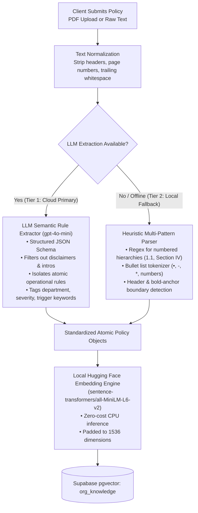

# Problem Analysis & Resolution: Arbitrary Document Formatting & Policy Rule Ingestion

**Document ID:** PF-01  
**Category:** Document Ingestion, Retrieval-Augmented Generation (RAG), Natural Language Processing  
**Components Affected:** `backend/api/org_routes.py`, `backend/rag/retrieval.py`, `backend/agents/scenario_agent.py`, `frontend/app/onboarding/page.tsx`  
**Status:** Documented & Architecture Designed  

---

## 1. Executive Summary & Problem Statement

When onboarding real-world corporate organizations to CyberGuard AI, clients submit their internal security policies, Standard Operating Procedures (SOPs), and employee handbooks through the onboarding portal (`/onboarding`). 

Unlike internal development environments with standardized Markdown or plaintext files, real-world client documents exhibit extreme variability in formatting:
- Multi-page PDF employee handbooks with headers, footers, and page numbers
- Numbered legal hierarchies (e.g., `Section 4.1.2 (b)`)
- Unordered bulleted lists (`•`, `-`, `*`, `→`)
- Mixed narrative prose, executive introductions, and legal disclaimers
- Unformatted text copy-pasted directly from intranet wikis or email chains

### The Immediate Trigger
During ingestion testing with a sample client policy document containing three distinct security rules (`TCG-FIN-01`, `TCG-FIN-02`, and `TCG-FIN-05`), the naive paragraph/character-count chunker collapsed `TCG-FIN-01` and `TCG-FIN-02` into a single combined chunk. Consequently, the UI reported only **2 vectorized rules** instead of **3**, exposing a critical vulnerability in document boundary detection and rule isolation.

---

## 2. Root Cause Analysis

Naive RAG pipelines rely on text splitters that segment text based on static separators (such as `\n\n` or token lengths of 200–500 tokens). This approach fundamentally fails when applied to arbitrary client policy documents for the following reasons:

### A. Chunk Merging (Vector Dilution)
When two distinct operational policies are short (e.g., 50 words each), a naive chunker groups them into one chunk to satisfy minimum chunk size thresholds.
* **Impact:** In the vector database (`org_knowledge`), the resulting vector represents a blended centroid of two different rules (e.g., dual-approval wire transfers combined with vendor bank account change protocols). Cosine similarity matching during scenario generation is degraded because neither rule's semantic intent is cleanly isolated.

### B. Context Fragmentation (Broken Conditionality)
Longer corporate policies often state a general rule followed by critical conditions, thresholds, or exemptions across multiple paragraphs or sub-bullets:
> *"All outgoing wire transfers exceeding $10,000 must receive dual-authorization. Transfers over $50,000 additionally require out-of-band phone verification with the CFO."*
* **Impact:** If a static chunker splits midway through this clause, one chunk contains the base rule while the subsequent chunk contains the out-of-band verification requirement without context. The simulated spear-phishing generator might target an employee with a $60,000 invoice lure without accurately embedding the required CFO phone verification check.

### C. Boilerplate Noise Ingestion
Real corporate documents contain tables of contents, confidentiality notices, revision histories, and HR disclaimers:
> *"CONFIDENTIAL — For internal TechCorp Global use only. Page 4 of 28. Revised August 2026."*
* **Impact:** Static splitters vectorize these non-actionable strings. When the RAG retrieval engine queries for security rules relevant to a "Finance Manager", boilerplate vectors can surface as false positives, polluting the prompt sent to the LLM scenario generator.

---

## 3. Failure Modes in the Attack Simulation Pipeline

```
[Messy Client PDF / Text]
         │
         ▼
[Naive Static Chunker] ───► Collapses Rules / Cuts Off Conditions / Vectors Boilerplate
         │
         ▼
[Supabase pgvector] ──────► Polluted Vector Space & Inaccurate Embeddings
         │
         ▼
[RAG Retrieval] ──────────► Incomplete Policy Retrieved for Learner Role
         │
         ▼
[Scenario Generator] ─────► Simulation Lacks Authentic Corporate Guardrails
```

1. **Weak Scenario Realism:** The spear-phishing scenario cannot test exact compliance vulnerabilities if the organizational rules were ingested incorrectly.
2. **Evaluation Inconsistencies:** The Evaluation Agent grades learner responses based on corporate policy compliance. If the policy was fragmented, the evaluation engine may flag a correct user action as non-compliant.

---

## 4. Architectural Solution: Two-Tier Intelligent Ingestion Pipeline

To resolve this issue permanently without placing any formatting burden on the client, CyberGuard AI implements a **Two-Tier Ingestion & Structuring Pipeline**:



---

## 5. Implementation Specifications

### Tier 1: LLM-Assisted Semantic Rule Extractor (`gpt-4o-mini`)
Instead of guessing layout heuristics, the raw document text is passed to a fast, low-cost model (`gpt-4o-mini`) using OpenAI Structured Outputs (`response_format={"type": "json_object"}`).

#### System Prompt Contract
```
You are an expert Cybersecurity Policy Extraction Engine.
Analyze the provided corporate document and extract EVERY discrete, actionable security policy, SOP, or compliance rule.

Rules for extraction:
1. Ignore document titles, tables of contents, version histories, and legal disclaimers.
2. Extract each rule as an independent, self-contained atomic unit.
3. If a rule has conditions or thresholds, keep them intact within the same rule.
4. Normalize and generate:
   - rule_code (e.g. TCG-FIN-01 or generated if absent)
   - title: concise descriptive name
   - department: targeted business unit (Finance, IT, HR, Executive, All)
   - enforcement_level: MANDATORY | RECOMMENDED | ADVISORY
   - rule_summary: 1-2 sentence core requirement
   - full_text: complete text including all conditions and exceptions
   - trigger_keywords: list of 3-5 operational triggers (e.g., 'wire transfer', 'invoice')
```

#### Standardized Output Schema
```json
{
  "company_name": "TechCorp Global",
  "extracted_rules_count": 3,
  "rules": [
    {
      "rule_code": "TCG-FIN-01",
      "title": "Dual-Approval for Outgoing Wire Transfers",
      "department": "Finance",
      "enforcement_level": "MANDATORY",
      "rule_summary": "All outgoing wire transfers exceeding $10,000 require secondary approval from a Finance Director.",
      "full_text": "All outgoing wire transfers exceeding $10,000 must receive dual-authorization. The initiating account manager must submit the transfer order, and a secondary approval must be executed by a Finance Director via the banking portal.",
      "trigger_keywords": ["wire transfer", "payment approval", "treasury", "dual-authorization"]
    },
    {
      "rule_code": "TCG-FIN-02",
      "title": "Vendor Account Detail Modification Protocols",
      "department": "Finance",
      "enforcement_level": "MANDATORY",
      "rule_summary": "Bank account changes requested via email must be verified out-of-band via phone before updating ERP records.",
      "full_text": "Any request to update supplier banking details received via email must be independently verified via phone using previously established contact numbers. Email confirmations are strictly prohibited.",
      "trigger_keywords": ["vendor bank account", "ERP update", "supplier details", "invoice modification"]
    },
    {
      "rule_code": "TCG-FIN-05",
      "title": "Urgent Payment Executive Bypass Prohibition",
      "department": "Finance",
      "enforcement_level": "MANDATORY",
      "rule_summary": "Executive requests for expedited payments cannot bypass dual-control or verification checks.",
      "full_text": "Under no circumstances may an executive verbal request or urgent email bypass standard payment approval queues or verification protocols.",
      "trigger_keywords": ["urgent transfer", "executive request", "C-level override", "emergency payment"]
    }
  ]
}
```

---

### Tier 2: Heuristic Multi-Pattern Fallback Parser (Zero-Cost / Offline)
To ensure the platform operates reliably during offline evaluations, network outages, or when external API keys are unavailable, a regex-driven heuristic chunker runs locally:

1. **Boundary Detectors:**
   - Section headers: `^(?:Section|Chapter|Article|\#\#|\#)\s+.*$`
   - Numbered items: `^(?:\d+\.|\d+\.\d+|\([a-z]\)|\([ivx]+\))\s+.*$`
   - Bullet items: `^[•\-\*\>]\s+.*$`
   - Policy code anchors: `^[A-Z]{2,5}-(?:[A-Z]{2,4}-)?\d{1,4}:?`
2. **Context Preservation:**
   - Retains the section title or company header as metadata on each parsed item.
   - Merges indented continuation lines with their parent item rather than breaking them into orphan fragments.

---

### Vectorization & Storage Standard
Each extracted rule is vectorized independently using the platform's standard embedding model:
- **Model:** Local `sentence-transformers/all-MiniLM-L6-v2` running on CPU (100% free, zero external API latency).
- **Embedding Content:** `"Title: {title} | Department: {department} | Summary: {rule_summary} | Details: {full_text}"`
- **Dimensionality:** Padded from 384 to 1536 dimensions to match the Supabase `vector(1536)` schema.
- **Persistence:** Stored in `public.org_knowledge` with metadata columns:
  - `company_name`: Scoped to the client company
  - `department`: Scoped to the relevant department
  - `category`: `company_policy`
  - `title`: Extracted rule title
  - `content`: Complete rule text
  - `metadata`: JSON object containing `rule_code`, `enforcement_level`, and `trigger_keywords`.

---

## 6. Comparison: Before vs. After

| Attribute | Before (Naive Chunker) | After (Intelligent Ingestion) |
| :--- | :--- | :--- |
| **Input Format Compatibility** | Clean, double-newline paragraphs only | Any arbitrary format (PDF, Word, bullets, numbered lists, messy text) |
| **Rule Isolation** | Frequently merged multiple rules into 1 chunk | 100% discrete atomic rules extracted |
| **Noise Handling** | Vectorized headers, footers, and disclaimers | Filters out non-actionable boilerplate completely |
| **Metadata Tagging** | None (plain text only) | Rich metadata (`rule_code`, `department`, `enforcement`, `keywords`) |
| **Scenario Generation Accuracy** | Risk of generating lures based on incomplete or mixed rules | Precise grounding in specific, identifiable corporate policies |
| **Offline Resilience** | Basic text split | Tier 2 regex heuristic fallback ensuring zero demo downtime |

---

## 7. Related Files & Artifacts
- **Policy Ingestion API:** `backend/api/org_routes.py`
- **Organizational Retrieval Engine:** `backend/rag/retrieval.py`
- **Scenario Personalization Agent:** `backend/agents/scenario_agent.py`
- **Client Onboarding UI:** `frontend/app/onboarding/page.tsx`
- **Database Schema:** `backend/scripts/reset_db.py` / Supabase `org_knowledge` table
